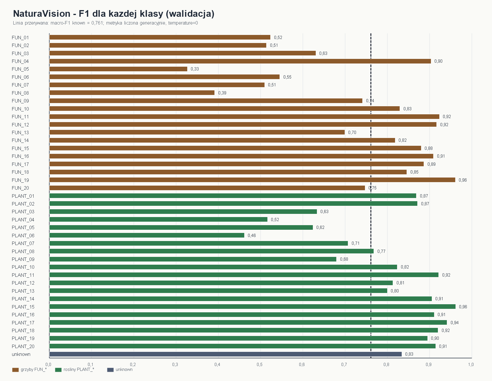
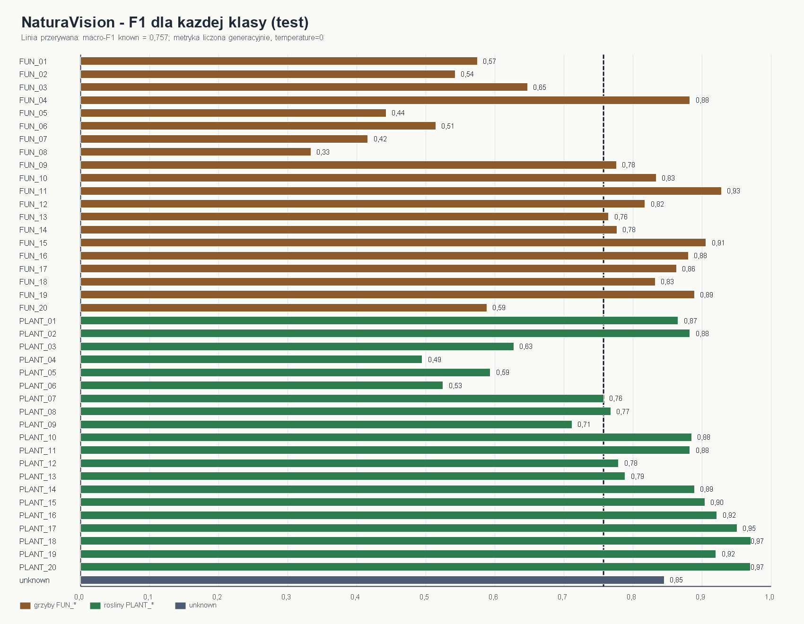

# Sprawozdanie z kolejnego kamienia milowego projektu NaturaVision

## Dane autora

Imie i nazwisko: Mateusz Adamczak

Numer albumu / grupa: 423062, projekt realizowany samodzielnie

Temat projektu: NaturaVision - lokalny model multimodalny do rozpoznawania roslin i grzybow lesnych

Data przygotowania sprawozdania: 26.04.2026

Zakres sprawozdania: kontynuacja po poprzednim raporcie KM1/KM2. Nie powtarzam tutaj pelnego opisu wyboru tematu, zrodla iNaturalist, manifestu klas ani pierwotnych splitow, poniewaz zostaly one opisane w poprzednim PDF-ie. Ten dokument skupia sie na zmianach wykonanych pozniej: przebudowie danych, lokalnym treningu `Qwen/Qwen3.5-4B`, problemach technicznych, ewaluacji generacyjnej i planie testu na telefonie.

---

## 1. Wprowadzenie

Ten raport jest dalszym ciagiem poprzedniego sprawozdania, w ktorym opisalem cel projektu, wybor zbioru iNaturalist, zamknieta taksonomie 40 gatunkow oraz pierwsze przygotowanie danych. W tym dokumencie traktuje tamte elementy jako punkt startowy i opisuje przede wszystkim to, co wydarzylo sie pozniej.

Aktualny kamien milowy dotyczy przejscia od przygotowanego zbioru danych do dzialajacego checkpointu modelu. Najwazniejsza zmiana polegala na tym, ze projekt przestal byc tylko planem i pipeline'em danych, a stal sie sprawdzonym eksperymentem treningowym z konkretnymi wynikami walidacji oraz testu.

Projekt nadal nie jest finalny. Kolejnym etapem pozostaje przygotowanie aplikacji mobilnej, eksport modelu do formatu nadajacego sie do uruchomienia na telefonie oraz test na rzeczywistym urzadzeniu.

---

## 2. Cel aktualnego kamienia milowego

Celem tego etapu bylo sprawdzenie, czy `Qwen/Qwen3.5-4B` da sie praktycznie dostroic lokalnie na moim komputerze z RTX 4070 12 GB i czy wynik bedzie wyraznie lepszy od modelu bazowego bez fine-tuningu.

W tym raporcie opisuje tylko nowe prace wykonane po poprzednim PDF-ie:

- oczyszczenie datasetu po wykryciu brakujacych obrazow,
- przebudowe formatu odpowiedzi z rozbudowanego JSON-a na minimalny `label_id`,
- przygotowanie lokalnego treningu `4-bit QLoRA` w WSL2,
- nieudane podejscia i decyzje techniczne zwiazane z ograniczona pamiecia GPU,
- trening dwuetapowy modelu,
- ewaluacje generacyjna checkpointu,
- porownanie z bazowym `Qwen/Qwen3.5-4B`,
- okreslenie, co zostaje do wykonania przed testem na telefonie.

Nie powtarzam szczegolowego opisu pobierania metadanych iNaturalist, listy klas ani pierwszych splitow, poniewaz te elementy zostaly juz udokumentowane w poprzednim sprawozdaniu.

---

## 3. Zmiany wzgledem poprzedniego etapu

Po poprzednim kamieniu milowym musialem doprowadzic dane do stanu, w ktorym dlugi trening nie przerwie sie przez pojedynczy brakujacy plik albo niespojny rekord. Najwazniejsza praktyczna zmiana dotyczyla przygotowania wariantu `v2-clean-r1`.

W tej wersji:

- usunalem rekordy z brakujacymi obrazami,
- przepisalem sciezki obrazow na absolutne sciezki w systemie plikow Linuxa,
- przenioslem dane poza OneDrive i `/mnt/c`, zeby trening w WSL mial szybszy dostep do plikow,
- rozbilem klase `unknown` na wewnetrzne podklasy `UNK_*`,
- dodalem hard-negative mining dla par klas, ktore sa do siebie wizualnie podobne,
- przygotowalem finalne pliki treningowe uzyte w tym etapie.

Po oczyszczeniu zbior uzyty w treningu i ewaluacji mial:

- `train.jsonl` - 14475 przykladow,
- `val.jsonl` - 2347 przykladow,
- `test.jsonl` - 2346 przykladow.

Dane treningowe dla tego etapu znajdowaly sie w katalogu:

```text
/home/<user>/naturavision-data-v2-clean-r1
```

---

## 4. Nowy format danych treningowych

Dane przekonwertowalem do formatu zgodnego z `ms-swift`. Kazdy rekord sklada sie z trzech rol:

- `system` - opisuje stale zasady zadania i zamknieta taksonomie,
- `user` - zawiera obraz i krotka instrukcje klasyfikacji,
- `assistant` - zawiera oczekiwana odpowiedz modelu.

Taki podzial jest potrzebny, poniewaz model multimodalny jest trenowany jak model konwersacyjny. Rola `system` ustawia stale reguly, rola `user` reprezentuje zapytanie uzytkownika wraz z obrazem, a rola `assistant` jest wzorcem odpowiedzi, ktorego model ma sie nauczyc.

Poczatkowo rozwazalem pelny JSON zawierajacy kilka pol, na przyklad nazwe lacinska, nazwe polska i krolestwo. W praktyce okazalo sie jednak, ze taki format moze zle ustawiac cel uczenia. Model dostaje wtedy duzo tokenow latwych do przewidzenia, takich jak nawiasy, nazwy pol JSON i powtarzalne fragmenty tekstu. Wysoka `token_acc` moglaby wtedy oznaczac glownie to, ze model dobrze nauczyl sie formatu odpowiedzi, a niekoniecznie to, ze poprawnie rozpoznaje obraz.

Dlatego w ulepszonej wersji danych ograniczylem odpowiedz do minimalnego JSON-a:

```json
{"label_id":"PLANT_01"}
```

Pelne informacje o gatunku sa pozniej odtwarzane przez lookup w `labels.json`. Takie podejscie ma dwie zalety. Po pierwsze, model koncentruje sie na wyborze klasy. Po drugie, warstwa wdrozeniowa moze zwracac bogatszy wynik bez zmuszania modelu do generowania dlugiego tekstu.

---

## 5. Walidacja przed treningiem

Przed treningiem przygotowalem walidacje datasetu. Sprawdzalem przede wszystkim:

- czy etykiety sa zgodne z manifestem,
- czy pliki obrazow istnieja,
- czy rekordy maja poprawny format `messages` i `images`,
- czy dane nie przeciekaja miedzy splitami,
- czy klasy maja oczekiwane liczebnosci,
- czy atrybucja licencyjna zostala zapisana.

Ten etap byl potrzebny, poniewaz praca z duzym publicznym zbiorem danych latwo prowadzi do problemow z brakujacymi plikami, niejednoznacznymi metadanymi albo powtorzeniami obserwacji. W moim przypadku dodatkowe filtrowanie bylo szczegolnie wazne, bo brakujace obrazy moglyby przerwac dlugi trening dopiero po wielu godzinach pracy.

---

## 6. Srodowisko treningowe

Trening przeprowadzilem lokalnie na komputerze z karta NVIDIA GeForce RTX 4070 12 GB. Srodowisko przygotowalem w WSL2 Ubuntu, poniewaz narzedzia treningowe i biblioteki GPU dzialaja stabilniej w srodowisku linuksowym.

Najwazniejsze elementy stosu treningowego to:

- `Qwen/Qwen3.5-4B` jako model bazowy,
- `ms-swift` jako framework treningowy,
- `bitsandbytes` do kwantyzacji 4-bitowej,
- `QLoRA` jako metoda lokalnego fine-tuningu,
- `bf16` jako dtype obliczeniowy,
- `rsLoRA` i `LoRA+` jako ulepszenia adapterow,
- `sdpa` jako backend attention w glownym runie tego etapu.

Poczatkowo planowalem klasyczny schemat: najpierw trenowanie modelu w pelniejszej precyzji, a dopiero pozniej kwantyzacja do wdrozenia. Ten plan okazal sie nierealistyczny dla mojego sprzetu. Pelny trening `Qwen/Qwen3.5-4B` wymaga znacznie wiekszej ilosci pamieci GPU niz 12 GB dostepne w RTX 4070. Dlatego zmienilem strategie na trening skwantyzowanego modelu przez `4-bit QLoRA`.

Glowna konfiguracja byla nastawiona na stabilnosc:

- `quant_method=bnb`,
- `quant_bits=4`,
- `bnb_4bit_quant_type=nf4`,
- `bnb_4bit_use_double_quant=true`,
- `bnb_4bit_compute_dtype=bfloat16`,
- `per_device_train_batch_size=1`,
- `gradient_accumulation_steps=32`,
- `max_pixels=150528`,
- `max_length=1280`,
- `target_modules=all-linear`,
- `freeze_vit=true`.

Testowalem tez opcje `Liger Kernel`, ale w lokalnym smoke tescie nie dala ona wystarczajacej przewagi predkosci ani pamieci, zeby wlaczyc ja do glownego runu. Probowalem rowniez przygotowac `flash-attn`, ale lokalne srodowisko nie mialo kompletnego `nvcc`/`CUDA_HOME`, dlatego w tym kamieniu milowym wybralem stabilniejszy wariant `sdpa`.

Rozwazalem tez kilka alternatywnych sciezek. Trening w chmurze, na przyklad na mocniejszym serwerze z kilkoma kartami GPU, zostawilem jako opcje awaryjna, poniewaz celem tego kamienia milowego bylo sprawdzenie, czy da sie osiagnac sensowny wynik lokalnie. `TurboQuant` potraktowalem jako potencjalna optymalizacje przyszlej inferencji, a nie jako technike treningowa. Ostatecznie najbezpieczniejszym wyborem dla tego etapu okazal sie lokalny `4-bit QLoRA` z ograniczona dlugoscia odpowiedzi.

---

## 7. Schemat treningu

Zastosowalem trening dwuetapowy.

W pierwszym etapie trenowalem glownie warstwe laczaca reprezentacje obrazu z modelem jezykowym. Ten etap traktuje jako dopasowanie alignera. W tej fazie:

- LLM byl zamrozony,
- vision encoder byl zamrozony,
- trenowany byl aligner,
- wykonano 453 kroki,
- trening trwal okolo 16 godzin i 37 minut,
- ostatni `eval_loss` wyniosl 0.1044,
- ostatni `eval_token_acc` wyniosl 0.9642.

W drugim etapie trenowalem adaptery modelu jezykowego razem z alignerem, nadal zostawiajac vision encoder zamrozony. Ten etap mial nauczyc model lepiej mapowac obraz i prompt na konkretna etykiete z taksonomii. W tej fazie:

- trening doszedl do `global_step=1359`,
- runtime wyniosl okolo 1 dzien, 11 godzin i 20 sekund,
- ostatni `eval_loss` wyniosl 0.0579,
- ostatni `eval_token_acc` wyniosl 0.9798,
- zapisany zostal checkpoint `best` oraz `last`.

Checkpoint wybrany po treningu znajduje sie w:

```text
/home/<user>/runs-v2-full-clean-r1/qwen35-qlora-forest/v0-20260424-170332/best
```

Warto podkreslic, ze `eval_loss` i `token_acc` traktowalem tylko jako metryki pomocnicze. Przy odpowiedziach w formacie JSON model moze bardzo dobrze przewidywac powtarzalne tokeny formatu, a jednoczesnie nadal mylic wlasciwe klasy. Dlatego kluczowa byla osobna walidacja generacyjna.

---

## 8. Problemy techniczne i decyzje projektowe

Po etapie opisanym w poprzednim PDF-ie najwazniejsze problemy dotyczyly juz nie samego pobrania danych, ale stabilnego treningu i poprawnego celu uczenia.

Pierwszym problemem byly sciezki plikow. Dane poczatkowo znajdowaly sie w katalogach Windows i OneDrive, co bylo niewygodne dla dlugiego treningu w WSL. Przenioslem dane do linuksowego systemu plikow i przepisalem sciezki obrazow w `train.jsonl`, `val.jsonl` i `test.jsonl` na absolutne sciezki Linuxa.

Drugim problemem bylo ryzyko `CUDA OOM`. Pierwotny wariant treningu byl zbyt ciezki dla RTX 4070 12 GB. Z tego powodu przeszedlem na `4-bit QLoRA`, ograniczylem rozdzielczosc obrazow przez `max_pixels`, ustawilem batch size na 1 i skorzystalem z gradient accumulation.

Trzecim problemem byla interpretacja metryk. Wysoka `token_acc` nie gwarantowala wysokiej skutecznosci klasyfikacji, poniewaz model mogl uczyc sie glownie poprawnego formatu JSON. To doprowadzilo mnie do przebudowy formatu odpowiedzi na minimalny `label_id` oraz do wyboru generacyjnej walidacji jako glownego kryterium oceny.

Waznym nieudanym podejsciem byla wczesniejsza wersja treningu, w ktorej model generowal bardziej rozbudowany JSON i byl oceniany zbyt mocno przez metryki teacher-forced. Ten wariant poprawnie uczyl sie skladni odpowiedzi, ale gorzej rozroznial same klasy. Na tescie osiagnal tylko okolo `accuracy=0.3142` i `macro_f1_known=0.2179`, mimo ze format JSON byl prawie zawsze poprawny. Ten wynik pokazal, ze samo dopilnowanie struktury odpowiedzi nie wystarcza i ze trzeba przestawic zadanie na zamknieta klasyfikacje przez `label_id`.

Czwartym problemem byla klasa `unknown`. W pierwszym podejsciu istnialo ryzyko, ze model zbyt czesto bedzie uciekal w `unknown`, poniewaz ta klasa jest logicznie szeroka. Dlatego rozbilem ja na wewnetrzne podklasy `UNK_*`, ale na zewnatrz nadal raportuje ja jako jedna klase publiczna.

Piatym problemem byly bardzo podobne wizualnie klasy. Najwiecej pomylek dotyczylo par takich jak:

- `FUN_07` i `FUN_08`,
- `PLANT_05` i `PLANT_06`,
- `PLANT_03` i `PLANT_04`,
- `FUN_01` i `FUN_02`,
- `FUN_05` i `FUN_06`.

Z tego powodu w ulepszonej wersji danych dodalem hard-negative mining i dosampling trudnych par.

---

## 9. Ewaluacja modelu

Po treningu przeprowadzilem ewaluacje generacyjna. W tym trybie model dostaje obraz oraz prompt, sam generuje odpowiedz, a nastepnie wynik jest parsowany i porownywany z etykieta prawdziwa. Ten sposob oceny jest wazniejszy niz teacher-forced `eval_loss`, poniewaz sprawdza dokladnie to, co dzieje sie podczas praktycznej inferencji.

Ewaluacje wykonywalem w trybie:

- `enable_thinking=false`,
- `temperature=0`,
- `top_k=1`,
- `top_p=1`,
- `max_new_tokens=64`.

Wyniki na zbiorze walidacyjnym:

| Metryka | Wartosc |
|---|---:|
| Liczba przykladow | 2347 |
| Poprawny JSON | 1.0000 |
| Accuracy | 0.7708 |
| Macro-F1 dla znanych klas | 0.7609 |
| Macro-F1 ogolne | 0.7627 |
| Precision dla `unknown` | 0.9453 |
| Recall dla `unknown` | 0.7464 |
| F1 dla `unknown` | 0.8341 |

Po potwierdzeniu wyniku na walidacji uruchomilem test na odlozonym zbiorze testowym. Tego zbioru nie uzywalem do podejmowania decyzji treningowych.

Wyniki na zbiorze testowym:

| Metryka | Wartosc |
|---|---:|
| Liczba przykladow | 2346 |
| Poprawny JSON | 1.0000 |
| Accuracy | 0.7690 |
| Macro-F1 dla znanych klas | 0.7572 |
| Macro-F1 ogolne | 0.7594 |
| Precision dla `unknown` | 0.9562 |
| Recall dla `unknown` | 0.7572 |
| F1 dla `unknown` | 0.8452 |

Najwazniejszy wniosek z ewaluacji jest taki, ze wynik testowy jest bardzo bliski walidacyjnemu. Oznacza to, ze checkpoint nie wyglada na przypadkowo dopasowany do zbioru walidacyjnego. Model zachowuje podobna skutecznosc na danych odlozonych.

Ponizej dodalem dwa wykresy F1 dla kazdej klasy. Pierwszy pokazuje wynik na zbiorze walidacyjnym, a drugi na zbiorze testowym. Kolor brazowy oznacza klasy grzybow `FUN_*`, zielony klasy roslin `PLANT_*`, a granatowy klase `unknown`. Linia przerywana pokazuje `macro_f1_known`, czyli sredni F1 liczony tylko po znanych klasach.



**Rysunek 1.** F1 dla kazdej klasy na zbiorze walidacyjnym.



**Rysunek 2.** F1 dla kazdej klasy na odlozonym zbiorze testowym.

### Porownanie z bazowym Qwen/Qwen3.5-4B

Aby sprawdzic, czy fine-tuning faktycznie poprawil model, uruchomilem dodatkowy test porownawczy dla bazowego `Qwen/Qwen3.5-4B` bez wytrenowanych adapterow. Porownanie wykonalo sie na tym samym `test.jsonl`, z tym samym promptem, tym samym trybem `nothink`, `temperature=0` i `max_new_tokens=64`. Roznica polegala na tym, ze w wariancie bazowym nie ladowalem adapterow QLoRA.

| Model | Accuracy | Macro-F1 known | Macro-F1 all | Valid JSON | Unknown F1 | Czas inferencji |
|---|---:|---:|---:|---:|---:|---:|
| Bazowy `Qwen/Qwen3.5-4B` bez fine-tuningu | 0.4126 | 0.3290 | 0.3216 | 0.9991 | 0.6720 | 1:26:29 |
| Moj checkpoint po treningu QLoRA | 0.7690 | 0.7572 | 0.7594 | 1.0000 | 0.8452 | 54:17 |

Poprawa po fine-tuningu byla wyrazna:

- accuracy wzroslo o 35.64 punktu procentowego,
- `macro_f1_known` wzroslo o 42.82 punktu procentowego,
- `unknown_f1` wzroslo o 17.31 punktu procentowego,
- czas generacyjnej ewaluacji skrocil sie z 1:26:29 do 54:17.

To porownanie pokazuje, ze bazowy model juz czesciowo rozumial instrukcje i potrafil zwracac prawie zawsze poprawny JSON, ale nie znal dobrze mojego zamknietego zadania klasyfikacyjnego. Dopiero trening na przygotowanej taksonomii nauczyl go stabilnego przypisywania obrazow do konkretnych klas.

Najlepiej wykrywane klasy na tescie to:

- `PLANT_18` - zawilec gajowy (`Anemone nemorosa`), F1 = 0.9703,
- `PLANT_20` - orlica pospolita (`Pteridium aquilinum`), F1 = 0.9697,
- `PLANT_17` - szczawik zajeczy (`Oxalis acetosella`), F1 = 0.9505,
- `FUN_11` - czubajka kania (`Macrolepiota procera`), F1 = 0.9278,
- `PLANT_16` - konwalia majowa (`Convallaria majalis`), F1 = 0.9216,
- `PLANT_19` - konwalijka dwulistna (`Maianthemum bifolium`), F1 = 0.9200,
- `FUN_15` - czernidlak kolpakowaty (`Coprinus comatus`), F1 = 0.9057,
- `PLANT_15` - wrzos zwyczajny (`Calluna vulgaris`), F1 = 0.9038.

Te klasy maja zwykle bardzo charakterystyczne cechy wizualne. Zawilec gajowy ma rozpoznawalne biale kwiaty, orlica pospolita ma forme paproci, szczawik zajeczy ma trojlistkowe liscie, a czubajka kania i czernidlak kolpakowaty maja bardzo wyrazne sylwetki owocnikow. To tlumaczy, dlaczego model radzi sobie z nimi znacznie lepiej niz z parami gatunkow roznicowanymi przez drobne cechy morfologiczne.

Najslabsze klasy na tescie to glownie trudne pary wizualne:

- `FUN_08` - F1 okolo 0.3333,
- `FUN_07` - F1 okolo 0.4158,
- `FUN_05` - F1 okolo 0.4423,
- `PLANT_04` - F1 okolo 0.4946,
- `FUN_06` - F1 okolo 0.5143,
- `PLANT_06` - F1 okolo 0.5250.

Najczestsze pomylki na tescie:

- `PLANT_06 -> PLANT_05` - 25 przypadkow,
- `FUN_08 -> FUN_07` - 21 przypadkow,
- `PLANT_04 -> PLANT_03` - 20 przypadkow,
- `FUN_07 -> FUN_08` - 16 przypadkow,
- `FUN_01 -> FUN_02` - 10 przypadkow,
- `FUN_06 -> FUN_05` - 10 przypadkow.

Najwazniejsze wnioski dla roslin:

- `PLANT_06 -> PLANT_05` oznacza, ze dab bezszypulkowy (`Quercus petraea`) byl najczesciej mylony z debem szypulkowym (`Quercus robur`). To bardzo zrozumiala pomylka, bo oba gatunki naleza do tego samego rodzaju i na wielu zdjeciach widac glownie liscie albo korone drzewa. Kluczowe roznice, takie jak dlugosc ogonkow lisciowych, nasada liscia albo szypulki zoledzi, czesto nie sa widoczne na typowych zdjeciach z iNaturalist.

- `PLANT_04 -> PLANT_03` oznacza pomylki brzozy omszonej (`Betula pubescens`) z brzoza brodawkowata (`Betula pendula`). Oba gatunki maja jasna kore, podobny pokroj i zblizone liscie. Cechy rozrozniajace, takie jak owlosienie mlodych pedow, szczegoly lisci albo siedlisko, sa subtelne i czesto znikaja przy zdjeciach wykonanych z daleka.

- `PLANT_05 -> PLANT_06` oraz `PLANT_03 -> PLANT_04` pokazuja, ze problem jest dwukierunkowy. Model nie myli tych klas przypadkowo, tylko ma trudnosc w rozdzieleniu par z tego samego rodzaju: debow miedzy soba oraz brzoz miedzy soba.

- `PLANT_12 -> PLANT_04` oznacza, ze leszczyna pospolita (`Corylus avellana`) czasem byla klasyfikowana jako brzoza omszona. Najbardziej prawdopodobna przyczyna to zdjecia samych lisci, bo obie rosliny moga miec szerokie, zabkowane liscie. Bez widoku calego krzewu, kotkow, orzechow albo kory model dostaje za malo cech odrozniajacych.

- `PLANT_01 <-> PLANT_02` oznacza wzajemne pomylki sosny zwyczajnej (`Pinus sylvestris`) i swierka pospolitego (`Picea abies`). Oba gatunki sa iglaste, a przy zblizeniach na igly, galazki albo kore zdjecie moze nie pokazywac najwazniejszych roznic, na przyklad igiel sosny zebranych w pary albo pojedynczych igiel swierka.

- `PLANT_03 -> PLANT_09` i `PLANT_09 -> PLANT_04` wskazuja na pomylki brzozy brodawkowatej, brzozy omszonej i osiki (`Populus tremula`). Sa to drzewa lisciaste, a przy zdjeciach lisci bez szerszego kontekstu kora, pokroj i ogonki lisciowe nie zawsze pomagaja modelowi.

Wnioski dla grzybow sa podobne. Najtrudniejsze byly pary `FUN_07` i `FUN_08`, czyli mleczaj rydz (`Lactarius deliciosus`) oraz mleczaj swierkowy (`Lactarius deterrimus`), a takze `FUN_05` i `FUN_06`, czyli maslak zwyczajny (`Suillus luteus`) oraz maslak sitarz (`Suillus bovinus`). Sa to gatunki z tych samych rodzajow, o podobnym kolorze, ksztalcie kapelusza i strukturze owocnikow. Model potrzebowalby wiecej zdjec pokazujacych cechy diagnostyczne, na przyklad blaszki, rurki, trzon, mleczko albo konkretne przebarwienia.

Te wyniki sa zgodne z intuicja biologiczna, poniewaz wymienione klasy sa do siebie wizualnie podobne. Nie traktuje tego jako awarii pipeline'u, ale jako naturalny kierunek dalszej poprawy danych. Najbardziej sensowna kolejna poprawka to zebranie dodatkowych zdjec dla trudnych par, szczegolnie takich, ktore pokazuja cechy diagnostyczne zamiast tylko ogolny wyglad rosliny albo grzyba.

---

## 10. Struktura projektu

Aktualna struktura repozytorium obejmuje kilka glownych czesci:

- `data/` - dane, manifest klas, splity i pliki JSONL,
- `data/v2/` - ulepszona wersja danych z minimalnym `label_id`, podklasami `UNK_*` i hard-negative mining,
- `scripts/` - skrypty do budowy datasetu, walidacji, konwersji i ewaluacji,
- `train/` - skrypty treningowe i launchery WSL,
- `docs/` - dokumentacja, runbooki i sprawozdania,
- `output/eval/` - podsumowania ewaluacji.

Najwazniejsze skrypty projektu to:

- `build_inat_subset.py` - budowa podzbioru z iNaturalist,
- `make_splits.py` - tworzenie splitow,
- `prepare_qwen_examples.py` - konwersja do formatu `ms-swift`,
- `filter_missing_image_rows.py` - usuwanie rekordow z brakujacymi obrazami,
- `evaluate_infer_results.py` - liczenie metryk generacyjnej ewaluacji,
- `train_qwen35_4b_qlora_wsl.sh` - glowny lokalny trening QLoRA,
- `run_qwen35_4b_qlora_v2_wsl.sh` - launcher ulepszonego treningu v2,
- `run_v2_val_eval_nothink_wsl.sh` - launcher walidacji i testu generacyjnego.

---

## 11. Rezultat tego kamienia milowego

Za najwazniejsze rezultaty tego etapu uwazam:

- przygotowanie oczyszczonego wariantu danych `v2-clean-r1`,
- uruchomienie lokalnego treningu `Qwen/Qwen3.5-4B` na RTX 4070 12 GB,
- przejscie z nierealistycznego pelnego treningu na praktyczny `4-bit QLoRA`,
- przebudowanie celu uczenia z pelnego JSON-a na minimalny `label_id`,
- przeprowadzenie treningu dwuetapowego,
- uzyskanie wyniku testowego `accuracy=0.7690`,
- uzyskanie `macro_f1_known=0.7572`,
- uzyskanie `valid_json_rate=1.0`,
- potwierdzenie przewagi nad bazowym `Qwen/Qwen3.5-4B` bez fine-tuningu,
- okreslenie nastepnego etapu: aplikacja Android, eksport modelu i test na telefonie.

Wynik testowy pokazuje, ze model nauczyl sie zadania w stopniu znacznie lepszym niz poprzednie podejscia. Szczegolnie wazne jest to, ze wynik walidacyjny i testowy sa bardzo podobne, co daje mi wieksza pewnosc, ze pipeline treningowy dziala poprawnie.

---

## 12. Dalsze mozliwe usprawnienia

Najbardziej naturalnym kierunkiem dalszej pracy byloby poprawienie klas, ktore model najczesciej myli. W praktyce oznacza to zebranie dodatkowych danych dla par:

- `FUN_07` i `FUN_08`,
- `PLANT_05` i `PLANT_06`,
- `PLANT_03` i `PLANT_04`,
- `FUN_01` i `FUN_02`,
- `FUN_05` i `FUN_06`.

Drugim kierunkiem bedzie przygotowanie aplikacji Android oraz eksportu modelu do formatu mobilnego, na przyklad przez GGUF albo inny format obslugiwany przez wybrana biblioteke inferencji. Po takim eksporcie trzeba podlaczyc lokalny runner modelu i wykonac test na rzeczywistym telefonie.

Trzecim kierunkiem bylaby dalsza optymalizacja promptu i dekodowania. Poniewaz model zwraca juz poprawny JSON w 100% przypadkow, mozna rozwazyc jeszcze krotszy format odpowiedzi, na przyklad samo `PLANT_01` albo `FUN_08`, a pelny JSON budowac wylacznie po stronie przyszlej warstwy aplikacyjnej.

---

## 13. Podsumowanie

W tym kamieniu milowym projektu NaturaVision skupilem sie na przebudowie danych pod realny trening, uruchomieniu lokalnego `4-bit QLoRA`, porownaniu kilku decyzji technicznych oraz generacyjnej ewaluacji checkpointu.

Najwieksza zmiana w trakcie projektu dotyczyla strategii treningu. Zamiast probowac trenowac pelny model i dopiero pozniej go kwantyzowac, przeszedlem na `4-bit QLoRA`, poniewaz tylko takie podejscie bylo realistyczne na moim sprzecie. Druga wazna decyzja dotyczyla formatu odpowiedzi: ograniczenie wyjscia do `label_id` sprawilo, ze cel uczenia lepiej odpowiadal rzeczywistemu zadaniu klasyfikacji.

Wynik testowy checkpointu, czyli `accuracy=0.7690` oraz `macro_f1_known=0.7572`, pokazuje, ze model dziala stabilnie i rozpoznaje duza czesc klas znacznie lepiej niz losowo. Jednoczesnie analiza pomylek jasno wskazuje, ktore pary gatunkow wymagaja dalszego dopracowania. Na tym etapie powstal dzialajacy, udokumentowany pipeline oraz checkpoint modelu, ktory mozna dalej przygotowywac do wdrozenia mobilnego. Nastepny kamien milowy powinien obejmowac integracje z aplikacja Android, uruchomienie na telefonie i praktyczny test mobilny.
