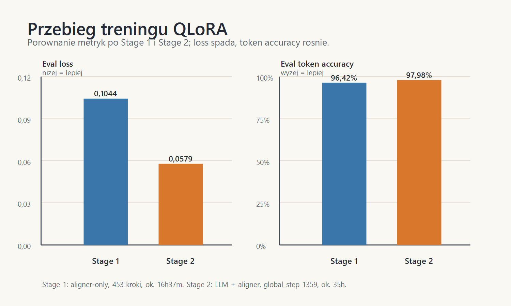
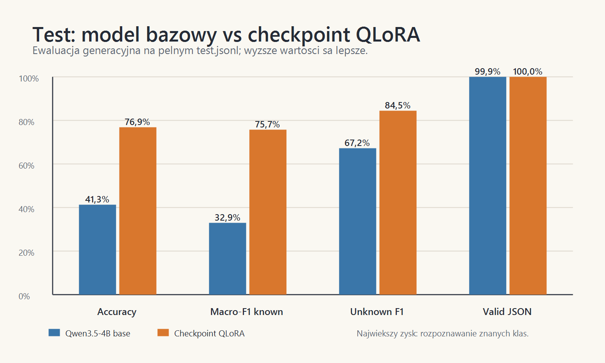
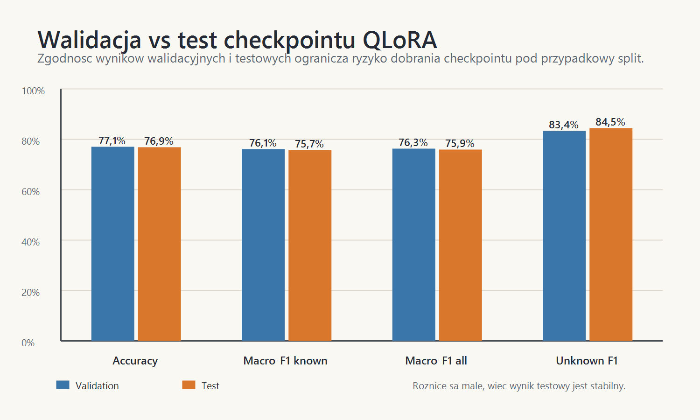

# Kamien milowy 4 - wizualizacja treningu i testow

## Dane autora

Imie i nazwisko: Mateusz Adamczak

Numer albumu / grupa: 423062, projekt realizowany samodzielnie

Temat projektu: NaturaVision - lokalny model multimodalny do rozpoznawania roslin i grzybow lesnych

Data przygotowania sprawozdania: 07.05.2026

Zakres dokumentu: ten kamien milowy jest raportem wizualnym. Nie powtarzam tutaj opisu datasetu, pipeline'u, przygotowania treningu ani szczegolow implementacyjnych z poprzedniego kamienia. Celem dokumentu jest pokazanie na wykresach, jak zachowal sie trening oraz jak model wypada w testach.

---

## 1. Cel wizualizacji

W tym raporcie skupiam sie na pieciu wykresach:

- przebiegu treningu po Stage 1 i Stage 2,
- porownaniu modelu bazowego z checkpointem po fine-tuningu,
- porownaniu wynikow walidacji i testu,
- rozkladzie F1 dla klas na walidacji,
- rozkladzie F1 dla klas na tescie.

Najwazniejsze pytanie tego kamienia milowego brzmi: czy wykresy potwierdzaja, ze checkpoint po treningu jest wyraznie lepszy od modelu bazowego i czy wynik jest stabilny poza zbiorem walidacyjnym.

---

## 2. Wykres treningu

**Wykres 1. Podsumowanie treningu.**

Wykres pokazuje dwie metryki po kolejnych etapach treningu. Po Stage 2 `eval_loss` spada z `0.1044` do `0.0579`, a `eval_token_acc` rosnie z `0.9642` do `0.9798`.

Interpretacja:

- nizszy `eval_loss` oznacza, ze model lepiej przewiduje oczekiwana odpowiedz,
- wyzszy `eval_token_acc` oznacza, ze model czesciej trafia w poprawne tokeny odpowiedzi,
- sama wysoka dokladnosc tokenow nie wystarcza do oceny klasyfikacji, dlatego najwazniejsze sa kolejne wykresy testowe.

---

## 3. Model bazowy vs checkpoint

**Wykres 2. Porownanie wynikow na zbiorze testowym.**

Ten wykres jest najwazniejszym podsumowaniem efektu treningu. Checkpoint po fine-tuningu jest wyraznie lepszy od modelu bazowego w metrykach klasyfikacyjnych.

Najwazniejsze roznice:

- `accuracy`: wzrost z `41.3%` do `76.9%`,
- `macro-F1 known`: wzrost z `32.9%` do `75.7%`,
- `unknown F1`: wzrost z `67.2%` do `84.5%`,
- `valid JSON`: oba modele prawie zawsze zachowuja poprawny format odpowiedzi.

Wniosek z wykresu: model bazowy dobrze utrzymuje format JSON, ale dopiero fine-tuning znacaco poprawia wybor wlasciwej klasy.

---

## 4. Walidacja vs test

**Wykres 3. Stabilnosc wyniku miedzy walidacja i testem.**

Wyniki walidacyjne i testowe sa bardzo zblizone. To wazne, bo oznacza, ze checkpoint nie wyglada na dobrany tylko pod walidacje.

Najwazniejsze obserwacje:

- `accuracy`: `77.1%` na walidacji i `76.9%` na tescie,
- `macro-F1 known`: `76.1%` na walidacji i `75.7%` na tescie,
- `unknown F1`: `83.4%` na walidacji i `84.5%` na tescie,
- `valid JSON`: `100%` w obu przypadkach.

Wniosek z wykresu: wynik testowy jest spojny z walidacja, wiec nie widac duzego spadku generalizacji.

---

## 5. F1 per klasa - walidacja

**Wykres 4. F1 dla kazdej klasy na zbiorze walidacyjnym.**

Ten wykres pokazuje, ze sredni wynik nie jest rownomierny dla wszystkich klas. Czesc klas jest rozpoznawana bardzo dobrze, a czesc pozostaje wyraznie trudniejsza.

Co widac na wykresie:

- najwyzsze slupki odpowiadaja klasom o charakterystycznym wygladzie,
- nizsze slupki wystepuja przy klasach podobnych wizualnie do innych etykiet,
- metryka F1 dobrze pokazuje klasy problematyczne, bo laczy precision i recall.

Wniosek z wykresu: dalsza poprawa modelu powinna koncentrowac sie nie na wszystkich klasach po rowno, ale na klasach o najnizszym F1.

---

## 6. F1 per klasa - test

**Wykres 5. F1 dla kazdej klasy na zbiorze testowym.**

Wykres testowy potwierdza podobny obraz jak walidacja. Najlepsze klasy utrzymuja wysokie F1, a najslabsze klasy nadal sa skupione wokol podobnych wizualnie par.

Najlepiej widoczne zjawiska:

- wiele klas roslin osiaga bardzo wysokie F1,
- czesc grzybow ma nizsze wyniki przez podobienstwo kapeluszy i duza zmiennosc zdjec,
- najtrudniejsze klasy sa dobrymi kandydatami do kolejnego hard-negative mining.

Wniosek z wykresu: test nie pokazuje losowego zalamania jakosci. Slabe punkty sa konkretne i mozna je adresowac przez celowane ulepszenie danych.

---

## 7. Podsumowanie wizualne

Zestaw wykresow pokazuje trzy najwazniejsze rzeczy:

- trening poprawil metryki wewnetrzne modelu,
- checkpoint po fine-tuningu jest znacznie lepszy od modelu bazowego na realnym tescie generacyjnym,
- wyniki walidacji i testu sa do siebie bardzo podobne, wiec rezultat jest stabilny.

Najwiekszy zysk po treningu widac w `macro-F1 known`, czyli w rozpoznawaniu znanych klas. Najwiekszy pozostaly problem to nierowny wynik dla poszczegolnych klas, szczegolnie tych podobnych wizualnie. Kolejny etap powinien skupic sie na aplikacji mobilnej, tescie na telefonie oraz ewentualnym ulepszaniu danych dla klas o najnizszym F1.
