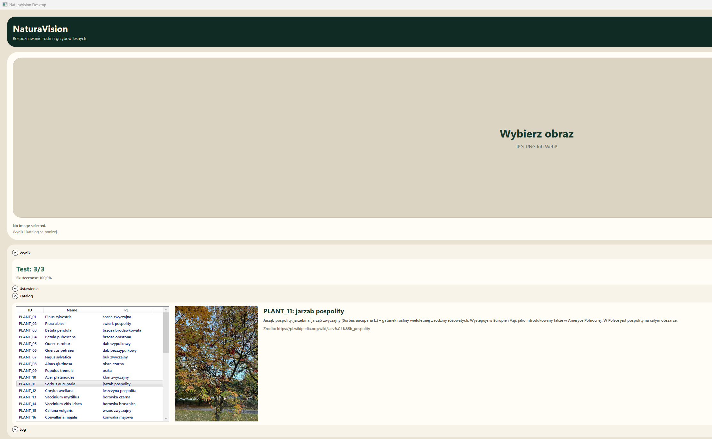
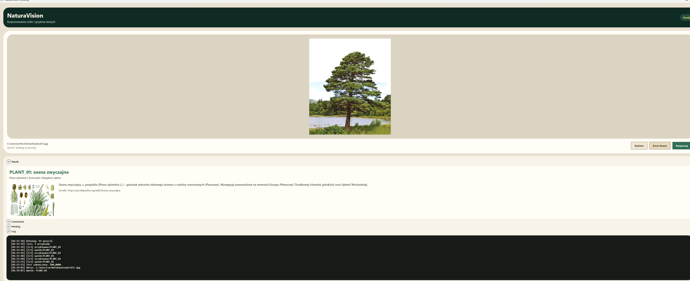
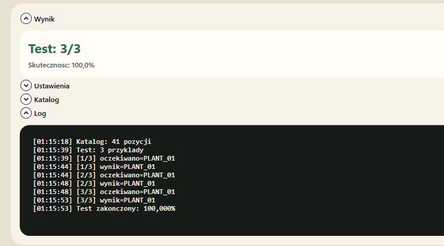

# Kamien milowy 5 - aplikacja demonstracyjna i proba wdrozenia modelu

## Dane autora

Imie i nazwisko: Mateusz Adamczak

Numer albumu / grupa: 423062, projekt realizowany samodzielnie

Temat projektu: NaturaVision - lokalny model multimodalny do rozpoznawania roslin i grzybow lesnych

Data przygotowania sprawozdania: 21.05.2026

Zakres dokumentu: ten kamien milowy opisuje probe uruchomienia modelu w aplikacji mobilnej, powod rezygnacji z tej sciezki w obecnym etapie oraz przygotowanie stabilniejszej aplikacji desktopowej. Nie powtarzam tutaj szczegolow treningu, datasetu ani wykresow z poprzednich kamieni milowych.

---

## 1. Cel kamienia milowego

Celem tego etapu bylo przejscie od wytrenowanego checkpointu do aplikacji, ktora mozna pokazac jako dzialajacy prototyp. Poczatkowo zakladalem aplikacje mobilna, poniewaz taki interfejs najlepiej pasuje do rozpoznawania organizmow w terenie. W praktyce najwiekszym ryzykiem okazal sie jednak nie sam interfejs, tylko lokalny runtime modelu multimodalnego na telefonie.

Po diagnostyce zdecydowalem sie przygotowac aplikacje desktopowa. Ta decyzja nie oznacza porzucenia aplikacji mobilnej jako pomyslu docelowego, ale byla bardziej realistyczna dla obecnego kamienia milowego: desktop pozwala pokazac model w dzialaniu na sprawdzonym sprzecie, bez ukrywania problemow z backendem Android/Vulkan.

---

## 2. Prototyp aplikacji mobilnej

Przygotowalem aplikacje Android w Kotlinie i Jetpack Compose. Aplikacja miala:

- wybor obrazu z galerii,
- obsluge szybkiego zdjecia z aparatu,
- ekran wyniku z `label_id`, nazwa polska, nazwa lacinska, nazwa angielska i krolestwem,
- lokalny katalog wszystkich klas modelu,
- parser odpowiedzi w formacie `{"label_id":"..."}`,
- dedykowany przycisk test suite do sprawdzania gotowosci aplikacji i runnera.

Dodatkowo przygotowalem strukture pod realny lokalny model GGUF. Aplikacja szukala paczki modelu, projektora obrazu i lokalnego runnera. Po stronie natywnej probowalem uzyc `llama.cpp` / `mtmd` przez JNI, czyli bez wysylania obrazu do zewnetrznej uslugi.

**Zrzut 1.** Test suite w aplikacji Android. Screenshot powinien pokazac ekran testow, status runnera oraz ostrzezenia zwiazane z lokalnym backendiem.

---

## 3. Co nie zadzialalo na telefonie

Testy na telefonie pokazaly, ze aplikacja potrafi uruchomic logike UI i test suite, ale lokalna inferencja przez natywny runner nie byla wiarygodna. Najwazniejszy problem nie wygladal na zwykly brak pamieci RAM. Model i projektor byly odnajdywane, a backend zaczynal generacje, ale odpowiedz modelu ulegala degeneracji.

Najwazniejsze obserwacje diagnostyczne:

- profil `phone_vulkan_current` generowal odpowiedz w stylu `{"label_id":"!!!!!!!!...`,
- profil `phone_vulkan_no_flash` zmienial blad na powtarzajace sie spacje, ale nadal nie dawal poprawnej klasy,
- zmiana flash attention zmieniala typ degeneracji, lecz nie rozwiazywala problemu,
- przy zwiekszaniu liczby tokenow obrazu roslo ryzyko niestabilnosci backendu,
- wymagania modelu multimodalnego byly trudniejsze niz dla zwyklego modelu tekstowego.

Wniosek: problem byl zwiazany glownie ze sciezka backendu `Android + Vulkan/Adreno + llama.cpp mtmd`, a nie z brakiem samego interfejsu aplikacji.

**Zrzut 2.** Ostrzezenie lub log diagnostyczny runnera na telefonie. Screenshot powinien pokazac, ze aplikacja dochodzi do etapu lokalnego backendu, ale wynik nie jest jeszcze stabilny.

---

## 4. Dlaczego zrezygnowalem z mobilnej sciezki w tym etapie

Zrezygnowalem z finalizowania aplikacji mobilnej w tym kamieniu milowym, poniewaz grozilo to oddaniem prototypu, ktory dobrze wyglada w UI, ale nie wykonuje stabilnie najwazniejszej funkcji projektu. W takim przypadku problemem nie bylaby kosmetyka, tylko zaufanie do calej demonstracji.

Najwazniejsze powody decyzji:

- telefonowy backend Vulkan zwracal zdegenerowane tokeny zamiast poprawnego JSON-a,
- Qwen3.5 jako model multimodalny jest bardziej wrazliwy na backend niz prostsze modele tekstowe,
- stabilna inferencja wymagala wysokiej liczby tokenow obrazu, co pogarszalo sytuacje na telefonie,
- utrzymywanie aplikacji mobilnej jako glownego demo wymagaloby osobnego portu runtime, np. CPU/OpenCL albo mniejszego modelu,
- desktop pozwalal pokazac ten sam model w bardziej kontrolowanych warunkach.

To byla decyzja inzynierska: lepiej pokazac dzialajacy wariant desktopowy i uczciwie opisac ryzyko mobilne, niz maskowac problem w aplikacji telefonicznej.

---

## 5. Aplikacja desktopowa

Po decyzji o zmianie sciezki przygotowalem aplikacje desktopowa w WPF. Jej glownym zalozeniem jest prosty przeplyw: uzytkownik wybiera obraz albo robi zrzut fragmentu ekranu, uruchamia rozpoznawanie i dostaje wynik z opisem gatunku.

Najwazniejsze funkcje aplikacji desktopowej:

- duze pole obrazu jako centralny element UI,
- przycisk `Wybierz` do wczytywania pliku,
- przycisk `Zrzut ekranu`, ktory korzysta z natywnego narzedzia Windows do wycinania fragmentu ekranu,
- przycisk `Rozpoznaj` do uruchomienia modelu,
- zakladka `Wynik` z przewidzianym `label_id`, nazwa polska, nazwa lacinska, zdjeciem i krotkim opisem,
- zakladka `Katalog` z pelna taksonomia,
- ukryte domyslnie ustawienia runtime,
- przycisk test suite do szybkiego sprawdzenia kilku przykladow z `test.jsonl`.

**Zrzut 3.** Ekran startowy aplikacji desktopowej. Screenshot powinien pokazac duze pole wyboru obrazu i podstawowe przyciski.

---

## 6. Integracja modelu na desktopie

Aplikacja desktopowa uruchamia model przez `llama-mtmd-cli.exe`. Zweryfikowana konfiguracja na moim komputerze uzywa:

- Windows x64,
- RTX 4070,
- CUDA build `llama.cpp`,
- modelu `forest-taxa-qwen35-4b-q4_k_m-fixed.gguf`,
- projektora `forest-taxa-qwen35-4b-mmproj-f16.gguf`,
- `GPU layers = 99`,
- `image tokens = 1024`,
- deterministycznego dekodowania,
- schematu JSON ograniczajacego wyjscie do dozwolonych `label_id`.

Wazna decyzja techniczna: w repozytorium nie przechowuje wag modelu. Sa one za duze i powinny byc pobierane osobno z Hugging Face. Repo zawiera kod, dokumentacje, katalog gatunkow i instrukcje uruchomienia, ale nie pelne checkpointy.

**Zrzut 4.** Wynik rozpoznawania w aplikacji desktopowej. Screenshot powinien pokazac przewidziana klase, zdjecie gatunku, opis i zrodlo.

---

## 7. Katalog gatunkow i opisy

Do aplikacji dodalem lokalny katalog mediow dla wszystkich klas. Dla kazdej rosliny i kazdego grzyba aplikacja ma:

- `label_id`,
- nazwe polska,
- nazwe lacinska,
- nazwe angielska,
- krotki opis po polsku,
- link do zrodla,
- jedno zdjecie zapisane lokalnie.

Opisy pochodza z polskiej Wikipedii. Zdjecia sa cache'owane lokalnie: tam, gdzie Wikimedia pozwolila pobrac miniatury, zapisane sa obrazy z Wikipedii/Wikimedia; tam, gdzie serwer ograniczyl pobieranie przez `429 Too many requests`, zostal uzyty lokalny fallback z datasetu. Dzieki temu aplikacja nie zalezy od internetu podczas demonstracji.

**Zrzut 5.** Zakladka katalogu gatunkow. Screenshot powinien pokazac liste klas oraz opis i obraz wybranego gatunku.

---

## 8. Przenosnosc na inne komputery

Na komputerze z RTX 4070 aplikacja ma gotowa, zweryfikowana sciezke uruchomienia. Na laptopach Windows on Arm, takich jak Vivobook S15 ze Snapdragon X Elite i 32 GB RAM, sytuacja jest inna. Sam interfejs WPF powinien sie uruchomic, ale domyslny runner modelu nie jest przenosny, poniewaz uzywa x64 CUDA i wymaga GPU NVIDIA.

Dla Snapdragon X Elite potrzebny bylby osobny port:

- natywny build `llama.cpp` dla Windows Arm64,
- backend CPU albo OpenCL dla Adreno,
- osobny smoke test multimodalny,
- ewentualnie mniejszy wariant modelu, jesli wydajnosc bedzie za niska.

32 GB RAM powinno wystarczyc na model Q4, ale to nie gwarantuje szybkiej ani stabilnej inferencji. Najwieksza roznica dotyczy nie RAM-u, tylko akceleracji.

---

## 9. Walidacja wykonanej pracy

Wykonane sprawdzenia:

- aplikacja desktopowa kompiluje sie przez `dotnet build`,
- katalog `data/taxonomy_media` zawiera opisy i obrazy dla 40 publicznych klas,
- aplikacja ma ukryte domyslnie ustawienia runtime, zeby glowny ekran byl prosty,
- wynik predykcji jest mapowany z `label_id` na pelne informacje o gatunku,
- README opisuje, jak pobrac wagi i uruchomic aplikacje.

**Zrzut 6.** Test suite w aplikacji desktopowej. Screenshot pokazuje krotki test na trzech przykladach, w ktorym aplikacja poprawnie odczytala oczekiwane klasy i uzyskala wynik `3/3`.

Mozliwe dalsze rozszerzenie dokumentu:

- opcjonalnie wygenerowac PDF po dodaniu obrazow.

---

## 10. Wnioski

Ten kamien milowy byl mniej o samym trenowaniu, a bardziej o praktycznym wdrozeniu modelu. Najwazniejsza lekcja jest taka, ze dobry wynik checkpointu nie oznacza automatycznie, ze model bedzie latwy do uruchomienia na kazdym urzadzeniu. W przypadku aplikacji mobilnej ograniczeniem okazal sie runtime multimodalny, a nie sam projekt UI.

Ostatecznie przygotowalem stabilniejsza aplikacje desktopowa, ktora lepiej nadaje sie do demonstracji obecnego stanu projektu. Aplikacja pokazuje caly przeplyw: obraz wejsciowy, lokalna inferencja, wynik klasyfikacji, opis gatunku i katalog taksonomii. Mobilna sciezka zostaje jako mozliwy kierunek dalszego rozwoju, ale wymaga osobnego portu i testow backendu.
